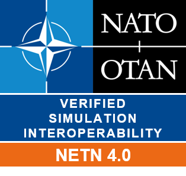
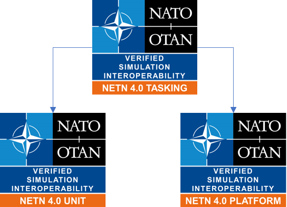

# Experimental NETN Test Suite

This repository will be used for the development of the NETN Test Suite. Currently it is only a draft and contains only initial design artefact.

## IVCT Compliance

The current test suite design uses the ServiceLoader interface feature of the IVCT framework. This is only available in the latest snapshot releases and not yet included in the production release. 

## NETN FOM

This test suite verify the NATO Education and Training Network (NETN) Federation Object Model (FOM). 
See also https://github.com/AMSP-04/NETN-FOM

## Test Suite Structure

The test suites modules are aligned to the badge structure. 

## Testing with Booster

Booster Config for PITIS-223 Test Environment:
- crc.PITIS-223@localhost:8688

local pRTI
- localhost:8989

These settings may be set via the SettingsDesignator setter of the test case object ("_tc_"), like 

    tc.setSettingsDesignator("crcAddress=localhost:8989");

or via the LRC.settings within the pRTI installation setup.

## LICENCE

Copyright 2025 NATO/OTAN

Licensed under the Apache License, [Version 2.0](http://www.apache.org/licenses/LICENSE-2.0)
